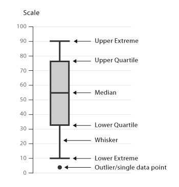

# Preparación de datos

## Preparación de datos

Suele ser necesario preparar los datos antes de empezar a usar algoritmos de
aprendizaje. La manipulación de los datos se facilita con el uso de algunos
paquetes como **dplyr** y **tidyr**. Algunas operaciones comunes son:

- selección de variables (columnas) (**select**)
- selección de instancias (filas) (**filter**)
- transformación de variables (**mutate**)
- obtener información de resumen (**summarise**)
- generar subgrupos de datos (**group_by**)
- conversiones de tipos de datos (**gather**, **spread**)
- unión de conjuntos de datos con variables comunes

## Uso de **dlpyr**

Para hacer ejemplos de manipulaciones con los datos se usará un
conjunto de datos incluido en **dplyr**. Para ello es preciso cargar esta
librería.

```{r include=FALSE}
knitr::opts_chunk$set(comment = NA, warning=FALSE, collapse=TRUE,fig.align='center')
# Permite cambiar la fuente
knitr::knit_hooks$set(mysize = function(before, options, envir) { 
  if (before) { 
    return(options$size) 
  } else { 
    return("\\normalsize") 
  } 
}) 
library(dplyr)
library(tidyr)
```

```{r eval=FALSE}
library(dplyr)
```

```{r}
#se usa el conjunto de datos starwars: consta de 87
# instancias (personajes) y 13 variables (caracteris.
# de cada personaje). En realidad los datos estan en
# formato tibble (un recubrimiento de data.frame que
# permite una manipulacion mas sencilla de los datos)
class(starwars)
```

---

Podemos consultar los atributos con:

```{r, echo=TRUE, mysize=TRUE, size="\\scriptsize"}
colnames(starwars)
```

y ver algunos datos, usando _head_ (para los primeros) y _tail_ (para los últimos):

```{r, echo=TRUE, mysize=TRUE, size="\\scriptsize"}
head(starwars, 3)
```

## Selección de variables

Sobre este conjunto de datos haremos las siguientes operaciones de
selección (en todas ellas el resultado es un nuevo conjunto de datos):

- selección de atributos concretos.
- selección de un rango de atributos.
- selección de todas excepto distintos atributos.

## Selección de variables

1. selección de 3 variables en concreto: **name**, **height**, **gender**.

\pause
```{r, mysize=TRUE, size="\\scriptsize"}
# se seleccionan algunas caracteristicas: name, height
# and gender
data1 <- dplyr::select(starwars, name, height, gender)
head(data1, 3)
```
## Selección de variables

2. Selección de variable (**name**) y variables comprendidas entre
**mass** y **species**.

\pause
```{r, mysize=TRUE, size="\\scriptsize"}
# se mantienen las variables name y las variables
# entre mass y species
data2 <- dplyr::select(starwars, name, mass:species)
colnames(data2)
```

## Selección de variables

3. todas las variables excepto las indicadas a continuación:
**birth_year** y **gender**.
\pause

```{r, mysize=TRUE, size="\\scriptsize"}
# se mantienen todas las variables exceptuando
# birth_year y gender
data3 <- dplyr::select(starwars, -birth_year, -gender)
colnames(data3)
```

## Selección de Instancias

Otra operación usual consiste en seleccionar o eliminar las instancias que
cumplan una determinada condición. En concreto, veremos ejemplos para: 

- selección de instancias correspondientes a personajes femeninos. 
- selección de personajes femeninos que vivan en **Alderaan**. 
- selección de personajes de **Alderaan**, **Coruscant** y **Endor**.

## Selección de Instancias

1. selección de instancias correspondientes a personajes femeninos.
\pause

```{r, mysize=TRUE, size="\\scriptsize"}
data4 <- dplyr::filter(starwars, sex=="female")
head(data4, 3)
```

## Selección de Instancias

2. selección de personajes femeninos que vivan en **Alderaan**. 
\pause

```{r, mysize=TRUE, size="\\scriptsize"}
data5 <- dplyr::filter(starwars, sex=="female" & homeworld=="Alderaan")
head(data5)
```

## Selección de Instancias

3. selección de personajes de **Alderaan**, **Coruscant** y **Endor**.
\pause

```{r, mysize=TRUE, size="\\scriptsize"}
# seleccion de personajes de Alderaan, Coruscant
# o Endor
data6 <- dplyr::filter(starwars,
    homeworld == "Alderaan" |
    homeworld == "Coruscant" |
    homeworld == "Endor")
```

\pause

```{r, mysize=TRUE, size="\\scriptsize"}
# la operacion anterior puede realizarse de forma
# mas abreviada usando el operador %in%
data7 <- dplyr::filter(starwars,
                       homeworld %in% c("Alderaan", "Coruscant", "Endor"))
head(data7, 3)
```

## Transformación de variables

Otra operación habitual consiste en introducir o transformar vari-
ables. En el siguiente código de R haremos:

- conversión de la altura a pies (1 pie equivale a 30.48 cm).
- conversión del peso de kilos a libras (1 kilo equivale a 2.20
libras).
- introducción de nuevas variables que categorizan los valores de
otra variable asociada (por ejemplo, una nueva variable que vale
alto si la altura es mayor de 180 y bajo en caso contrario; otra
reduce los valores posibles para el color de ojos).
- se determinan valores anómalos para una variable y se sustituyen
por una marca especial (NA).


## Transformación de variables

1. conversión de la altura a pies (1 pie equivale a 30.48 cm).
2. conversión del peso de kilos a libras (1 kilo equivale a 2.20).
\pause

```{r, mysize=TRUE, size="\\scriptsize"}
# uso de mutate para cambiar valor de variables: se pasa
# la altura a pies y el peso a libras
data8 <- dplyr::mutate(starwars,
height = height / 30.48,
mass = mass * 2.205)
head(select(starwars, height, mass), 2)
head(select(data8, height, mass), 2)
```

## Renombrado de variables

Una opción muy popular es renombrar variables, en particular en fuentes externas
de las que no podemos cambiar nada. 

1. Cambiar el atributo *homeworld* por *planet*.

\pause

```{r, mysize=TRUE, size="\\scriptsize"}
# uso de rename para cambiar el valor de la variable
data9 <- dplyr::rename(starwars, 
                planet = homeworld)
colnames(data9)
```

## Transformación de variables

3. introducción de nuevas variables que categorizan los valores de
otra variable asociada (por ejemplo, una nueva variable que vale
alto si la altura es mayor de 180 y bajo en caso contrario; otra
reduce los valores posibles para el color de ojos).

\pause

```{r, mysize=TRUE, size="\\scriptsize"}
# uso de mutate para modificar variables: si la altura
# es mayor de 180 la nueva variable (heightcat) vale
# tall y en caso contrario vale short. Se observa el
# uso de ifelse para asignar valor
data10 <- dplyr::mutate(starwars,
heightcat = ifelse(height > 180, "tall", "short"))
head(select(data10, height, heightcat), 5)
```

## Transformación de variables

4. se determinan valores anómalos para una variable y se sustituyen
por una marca especial (NA).

\pause
```{r, mysize=TRUE, size="\\scriptsize"}
# en este ejemplo se dejan solo los colores mas habituales
# de ojos (y los demas valores que pudieran aparecer se
# asignan a NA)
data11 <- dplyr::mutate(starwars,
eye_color = ifelse(eye_color %in% c("black", "blue", "brown"),
                   eye_color, NA))
# se buscan valores anomalos de altura y se sustituyen
# por NA
data12 <- dplyr::mutate(starwars,
                 height = ifelse(height < 75 | height > 200, NA, height))
# se borran los objetos R que ya no se vayan a usar
# mediante rm
rm(data12)
```

## Medidas de resumen

La obtención de medidas de interés (media, desviación, etc) sobre los datos
puede realizarse de forma sencilla mediante summarise.

\pause
```{r, mysize=TRUE, size="\\scriptsize"}
# se calculan las medias y desviaciones de altura y peso
# mediante la funcion summarise. EL resultado es otro objeto
# con una fila y dos columnas (una para cada medida)
medidas <- dplyr::summarise(starwars,
                  mean_ht = mean(height, na.rm=TRUE),
                  sd_ht = sd(height, na.rm=TRUE),
                  mean_mass = mean(mass, na.rm=TRUE),
                  sd_mass = sd(mass, na.rm = TRUE))
medidas
```

## Medidas de resumen

La función summarise puede usarse en combinación con el agrupamiento de datos.
Por ejemplo, podemos responder así a la pregunta de cual es la media de altura y
peso de los datos agrupados por sexo. Para agrupar se usa la función
**group_by**, y este nuevo objeto es el que se pasará a la función summarise.

---

```{r, mysize=TRUE, size="\\scriptsize"}
# se calculan las medidas de altura y peso por sexo.
# En primer lugar se agrupan los datos
datosSexo <- dplyr::group_by(starwars, gender)
# se obtienen ahora las medidas de interes
medidasSexo <- dplyr::summarise(datosSexo,
                                mean_ht = mean(height, na.rm=TRUE),
                                mean_wt = mean(mass, na.rm=TRUE),
                                .groups = "drop")
medidasSexo
```

## Cambio de formato

Imaginemos que tenemos los siguientes grados:

```{r, mysize=TRUE, size="\\scriptsize", echo=F}
data <- read.csv('gather.csv')
knitr::kable(data)
```

Y el objetivo es cambiar su formato para obtener otra
perspectiva de los datos, con las variables:

                Grupo Año Trim Beneficio
                
## Cambio de formato

La conversión se haría de la siguiente forma:

- Habrá una única columna con la variable Trim (con tres posibles
valores: Trim1, Trim2 y Trim3).

- El nuevo conjunto de datos tendrá más filas, porque se formará una combinación
con cada valor de Grupo, Año y Trim (de modo que para cada valor de Grupo y Año
habrá tres instancias: una para cada valor posible de Trim)

- la variable Beneficio contendrá el valor asociado a las columnas Trim1, Trim2
o Trim3 del conjunto de datos original (según corresponda)

## Cambio de formato

La conversión se realiza mediante la sentencia **gather**:
\pause

```{r, mysize=TRUE, size="\\scriptsize"}
longFormat <- data %>%
              tidyr::gather(Trim, Beneficio, Trim1:Trim3)
head(longFormat, 10)
```

## Cambio de formato

El proceso inverso se realiza mediante la sentencia **spread**:
\pause

```{r, mysize=TRUE, size="\\scriptsize"}
data <- longFormat %>%
              tidyr::spread(Trim, Beneficio)
head(data)
```


## Unión de conjuntos de datos


Suele ser habitual la necesidad de unir varios conjuntos de datos, teniendo en
cuenta que deben hacerse coincidir las instancias por el valor de alguna
variable. Por ejemplo, agregar al conjunto de datos starwars los datos obtenidos
de los distintos planetas. Así, para cada personaje se puede indicar información
sobre su especie.

```{r, mysize=TRUE, size="\\scriptsize", eval=FALSE}
# uso de merge para combinar conjuntos de datos por el
# valor de alguna variable. Imaginemos que queremos agregar
# al conjunto de datos original información sobre el planeta 
# de origen, de forma que aparezca para cada personaje 
# en función de su origen
datos <- merge(starwars, info_planet, by = c("homeworld")))
```

## Uso de _pipes_

::: columns

:::: {.column width="70%"}
Los paquetes como dplyr y tidyr permiten escribir código de forma
compacta usando el operador %>% que permite pasar la salida de
una operación a otra nueva.
::::

:::: {.column width="30%"}

::::

::: 

```{r, mysize=TRUE, size="\\scriptsize"}
medidas <- starwars %>%
                filter(gender == "masculine") %>%
                group_by(species) %>%
                summarise(mean_ht = mean(height, na.rm = TRUE))
head(medidas, 4)
```

## Otro ejemplo de pipe

Vamos a contar para cada planeta los personajes, y obtener los 4 planetas que
aparecen más.

\pause

```{r, mysize=TRUE, size="\\scriptsize"}
# Por defecto arrange ordena de forma ascendente (menores arriba), para
# cambiarlo hay que hacer arrange(desc())
planets <- starwars %>% filter(!is.na(homeworld)) %>%
             # Cuenta el número de planetas distintos
             count(homeworld) %>%
             # count devuelve n, se renombra
             rename(personajes=n) %>%
             # ordeno de forma descendente
             arrange(desc(personajes))
             
head(planets, 4)
```

## Ejercicios de transformación

- Cargar los datos del archivo DatosSocialesAndalucia.csv.

- Obtener los nombres de todas las variables.

- Determinar el número de instancias y columnas del conjunto de
datos.

- Seleccionar del conjunto de datos únicamente las variables relacionadas con
  Provincia y PoblacionTotal.
  
- Filtrar los datos de cada provincia para determinar cuántas instancias hay de
  cada.
  
- Crear una nueva variable que refleje la proporción de habitantes
menores de 65. La variable se llamará **Cotizantes**.

- Incluir una nueva variable booleana que indique si hay incremento de
población o no. La variable se llamará **Crece**.

- Listar las provincias y su población ordenadas por población (agrupando por
provincia y sumando). 

# Introducción a ggplot

## Introducción a ggplot

**ggplot2** es con diferencia el elemento de R mejor valorado para Ciencias de
Datos.

Tiene una filosofía muy diferente de otros entornos como **matplotlib**, está
basado en **Grammar of graphics** o **Gramática de gráficos**. Consiste en crear
los gráficos por capas (de datos a usar, tipo de gráfico, ...) que se unen (con
el símbolo +). Es muy fácil de usar pero al mismo tiempo muy personalizable.

Vamos a ver sólo un poco como usarlo con ejemplos, no todas las opciones posibles, existen
otros tutoriales recomendables[^1].

[^1]: [https://www.cedricscherer.com/2019/08/05/a-ggplot2-tutorial-for-beautiful-plotting-in-r/](https://www.cedricscherer.com/2019/08/05/a-ggplot2-tutorial-for-beautiful-plotting-in-r/)

## Cargamos unos datos de ejemplo

```{r, mysize=TRUE, size="\\scriptsize"}
library(ggplot2)
library(mosaicData)
# se cargan los datos del paquete mosaicData: incluye
# datos obtenidos para estudiar las relaciones entre
# salarios y experiencia laboral
df <- data(CPS85 , package = "mosaicData")
df <- CPS85
colnames(df)
```

## Introducción a ggplot

Una gráfica **ggplot** se contruye por combinación de distintos elementos: 

- *Data*: Los datos (tabla o *dataframe*) que se desean visualizar.
- *Aesthetics aes()*: Estética, como el eje, color, tamaño, forma ...
- *Geometries geom_*: El tipo de figura.
- *Labs*: Titulos del eje de coordenadas, leyenda, ...
- *Scales scale_*: Relación entre datos y las dimensiones. 
- *Facets facet_*: Atributos sobre los que agrupar.
- *Visual themes theme()*: Aspectos visuales como el fondo, eje, texto, colores,
  ...

## Introducción a ggplot

ggplot requiere primero un conjunto de datos, y los atributos a visualizar.

la funcion ggplot especifica la el conjunto de datos a visualizar y establece la
relacion entre las variables y las propiedades visuales del grafico. 

Estas relaciones se establecen con la la funcion aes (aes - aesthetics). 

---

Vamos a visualizar el salario (**wage**) en función de la experiencia
(**exper**)

```{r, mysize=TRUE, size="\\scriptsize",out.width='60%'}
ggplot(data=df, aes(x = exper, y=wage))
```
\pause
¿Y los datos? 
No hay porque no hemos indicado el tipo de figura que queremos, solo el eje de
  coordenadas.
  
## Introducción a ggplot

El código anterior genera un gráfico vacío, porque no se ha indicado
qué variable debería mostrarse en el eje X y cuál en el eje Y. Sin
embargo, no se ha definido qué queremos visualizar en el gráfico.

Esto se realiza especificando los objetos geométricos que se mostrarán
en el gráfico: puntos, líneas, barras, etc: 

- **geom_point**: Pinta puntos (_scatter_).
- **geom_plot**: Pinta líneas.
- ...

Ejemplo:

```{r, mysize=TRUE, size="\\scriptsize", eval=FALSE}
ggplot(data=df, aes(x = exper, y=wage)) + 
       geom_point()
```
El signo + debe situarse al final de la línea, no al principio.
 
---

```{r, mysize=TRUE, size="\\scriptsize", out.width='60%'}
ggplot(data=df, aes(x = exper, y=wage)) + 
       geom_point()
```

Se observa un punto muy extremo en sueldo que _fastidia_ la escala, limitamos el
rango. Lo filtramos:

```{r, mysize=TRUE, size="\\scriptsize", out.width='60%'}
filtrados <- dplyr::filter(df, wage < 40)
```

---

```{r, mysize=TRUE, size="\\scriptsize", out.width='60%'}
ggplot(data=filtrados, aes(x = exper, y=wage)) + 
       geom_point()
```

Muy feo, podemos poner opciones a visualizar dentro de geom_point, como el
color (negro por defecto), si usar transparencias (por defecto es opaco), o el
tamaño del punto (sobre el de referencia, > 1 lo aumenta).

---

```{r, mysize=TRUE, size="\\scriptsize", out.width='70%'}
ggplot(data=filtrados, aes(x = exper, y=wage)) + 
       geom_point(color='cornflowerblue', alpha=0.7,size=3)
```

Esto está mucho más bonito, ¿no?

Podemos usar los colores no sólo por estética, si no para distinguir.

## Distinguiendo por sexo usando colores

```{r, mysize=TRUE, size="\\scriptsize", out.width='70%'}
ggplot(data=filtrados, aes(x = exper, y=wage, color=sex)) + 
       geom_point(alpha=0.7,size=3)
```

Falta mejorar el eje de coordenadas, ¿no?

---

Podemos guardar la figura.

```{r, mysize=TRUE, size="\\scriptsize", out.width='70%'}
g <- ggplot(data=filtrados, aes(x = exper, y=wage, color=sex)) + 
       geom_point(alpha=0.7,size=3) +
       labs(x="Experiencia", y="Salario", color="Sexo") +
       theme(text=element_text(size=20))
g
```

## Distinguiendo por sexo por separado

Podemos añadir elementos para adaptar la figura.
Usamos **facet_wrap** (o **facet_grid**) para separar por atributos.

```{r, mysize=TRUE, size="\\scriptsize", out.width='70%'}
g + facet_wrap(~sex)
```

---

Usar una técnica que ajusta una serie de puntos, **geom_smooth**.
Ajustamos los colores manualmente con **scale_color_manual**.

```{r, mysize=TRUE, size="\\scriptsize", out.width='70%'}
g + facet_wrap(~sex) +
    geom_smooth(method = "lm", formula=y ~ x, color="red") +
    scale_y_continuous(label = scales::dollar) + # Añadimos un $
    scale_color_manual(values = c("indianred3", "cornflowerblue"))
```

## Uso combinado de facet para variable sector

```{r, mysize=TRUE, size="\\scriptsize", out.width='70%', warning=FALSE, message=FALSE}
g + geom_smooth(method = "auto", se = FALSE, size = 1.5) +
scale_y_continuous(label = scales::dollar) +
scale_color_manual(values = c("indianred3","cornflowerblue")) +
facet_wrap(~sector)
```

## Aplicando título, subtítulo y caption

```{r, mysize=TRUE, size="\\scriptsize", echo=FALSE}
anterior <- g + geom_smooth(method = "auto", se = FALSE, size = 1.5) +
scale_y_continuous(label = scales::dollar) +
scale_color_manual(values = c("indianred3","cornflowerblue")) +
facet_wrap(~sector)
```

```{r, mysize=TRUE, size="\\scriptsize", out.width='70%', warning=FALSE, message=FALSE}
anterior + 
labs(title="Relaciones entre salario y experiencia", 
      subtitle="Resumen de la población global", 
      caption = "source: http://mosaic-web.org")
```

## Aplicando tema, usando **theme_** de _ggthemes_

```{r, mysize=TRUE, size="\\scriptsize", echo=FALSE}
library(ggthemes)
```

```{r, mysize=TRUE, size="\\scriptsize", out.width='70%', warning=FALSE, message=FALSE}
anterior +
labs(title="Relaciones entre salario y experiencia", 
      subtitle="Resumen de la población global", 
      caption = "source: http://mosaic-web.org") +
      theme_light() + theme(text=element_text(size=20))
```

# Gráficos de una variable

Son gráficos muestran la distribución de una variable, que pueden 
ser categóricos o cuantitivas.

- Categóricos: Se aplica diagrama de barras.

- Cuantitativas: Distribución, diagramas de box-plot ó violin.

## Estudio de distribución por sectores

Vamos a estudiar cómo se distribuyen los ejemplos por sector. Usamos para ello 
**geom_bar**.

```{r, mysize=TRUE, size="\\scriptsize", out.width='70%', warning=FALSE, message=FALSE}
ggplot(df, aes(x = sector)) +
     geom_bar()
```

---

Pongámoslo más bonito:

```{r, mysize=TRUE, size="\\scriptsize", out.width='70%', warning=FALSE, message=FALSE}
ggplot(df, aes(x = sector)) +
geom_bar(fill="cornflowerblue") +
labs(x = "Sector", y = "Contador", title="Trabajadores por sector")
```

---

En porcentaje, se puede usar ..count.. que indica el número de instancias en
cada caso.

```{r, mysize=TRUE, size="\\scriptsize", out.width='70%', warning=FALSE, message=FALSE}
ggplot(df, aes(x = sector, y=..count../sum(..count..))) +
geom_bar(fill="cornflowerblue") +
labs(x = "Sector", y = "Porcentaje", title="Trabajadores por sector")
```

---

Versión final, ordenado y con valores:

```{r, mysize=TRUE, size="\\scriptsize", out.width='70%', warning=FALSE, message=FALSE}
ggplot(df %>% count(sector), aes(x = reorder(sector, n), y=n)) +
geom_bar(fill="cornflowerblue", stat="identity") +
geom_text(aes(label=n), vjust=-1) +
labs(x = "Sector", y = "Porcentaje", title="Trabajadores por sector")
```

---

Rotar el eje x usando _angle_ de **element_text**

```{r, mysize=TRUE, size="\\scriptsize", out.width='70%', warning=FALSE, message=FALSE}
ggplot(df %>% count(sector), aes(x = reorder(sector, n), y=n)) +
geom_bar(fill="cornflowerblue", stat="identity") +
geom_text(aes(label=n), vjust=-1) + 
labs(x = "Sector", y = "Porcentaje", title="Trabajadores por sector") +
theme(axis.text.x = element_text(angle = 45, hjust=1))
```

---

También se puede poner horizontal con **coord_flip()**

```{r, mysize=TRUE, size="\\scriptsize", out.width='70%', warning=FALSE, message=FALSE}
ggplot(df %>% count(sector), aes(x = reorder(sector, n), y=n)) +
geom_bar(fill="cornflowerblue", stat="identity") +
geom_text(aes(label=n), hjust=1.5, color="white") + coord_flip() +
labs(x = "Sector", y = "Porcentaje", title="Trabajadores por sector")
```

--- 

## Diagrama de sectores

```{r, mysize=TRUE, size="\\scriptsize", out.width='70%', warning=FALSE, message=FALSE}
ggplot(df %>% count(sector), aes(x="", y=n, fill=sector)) +
geom_bar(stat="identity",width=1)+
coord_polar("y", start=0)+
labs(x = NULL, y = NULL, fill = "Sector")
```

---

Podemos crear un nuevo dataframe

```{r, mysize=TRUE, size="\\scriptsize", out.width='70%',warning=FALSE,message=FALSE}
categories <- df %>% group_by(sector) %>%
                 summarize(total=n())
categories <- categories %>% mutate(prop=round(100*total/sum(total), 1))
head(categories,10)
```

---

Ahora lo usamos para poder indicar el valor por cada.

```{r, mysize=TRUE, size="\\scriptsize", out.width='70%',warning=FALSE,message=FALSE}
ggplot(categories, aes(x="", y=total, fill=sector)) +
geom_bar(stat="identity",width=1)+
coord_polar("y", start=0)+
labs(x = NULL, y = NULL, fill = "Sector")+
geom_text(aes(label = paste0(prop, "%")), position = position_stack(vjust=0.5))+
theme_void()
```

## Diagrama de área

```{r, mysize=TRUE, size="\\scriptsize", out.width='70%',warning=FALSE,message=FALSE}
library('treemapify')
ggplot(categories, aes(fill=sector, area=total,label=sector)) +
geom_treemap() +
labs(title="Trabajadores por sector",fill="Sector")
```

## Diagrama de área, sin leyenda

```{r, mysize=TRUE, size="\\scriptsize", out.width='70%',warning=FALSE,message=FALSE}
ggplot(categories, aes(fill=sector, area=total,label=sector)) +
geom_treemap() +
geom_treemap_text(colour="white",place="center")+
labs(title="Trabajadores por sector",fill="Sector")+
theme(legend.position="none")
```

## Distribución

Vamos a estudiar la distribución por edad:

```{r, mysize=TRUE, size="\\scriptsize", out.width='70%', warning=FALSE, message=FALSE}
ggplot(df, aes(x=age)) +
geom_histogram(fill="cornflowerblue",bins=20) +
labs(title="Distribución por edad", x="Edad", y="Casos")
```

---

Podemos poner la escala de un eje de forma porcentual

```{r, mysize=TRUE, size="\\scriptsize", out.width='70%', warning=FALSE, message=FALSE}
ggplot(df, aes(x=age,y=..count../sum(..count..))) +
geom_histogram(fill="cornflowerblue",bins=20) +
labs(title="Distribución por edad", x="Edad", y="Ratio") +
scale_y_continuous(labels=scales::percent_format(scale = 1))
```


## Gráfico de densidad

```{r, mysize=TRUE, size="\\scriptsize", out.width='70%', warning=FALSE, message=FALSE}
ggplot(df, aes(x=age)) +
geom_density(fill="cornflowerblue", alpha=0.5) +
labs(title="Distribución por edad", x="Edad", y="Densidad")
```

## Gráfico de densidad por sexo

```{r, mysize=TRUE, size="\\scriptsize", out.width='70%', warning=FALSE, message=FALSE}
ggplot(df, aes(x=age,fill=sex)) +
geom_density(alpha=0.5) +
labs(title="Distribución por edad", x="Edad", y="Densidad",fill="Sexo") +
scale_fill_manual(values = c("indianred3","cornflowerblue"))
```

# Gráficos de varias variables

## Diagramas de barras
Es muy común usar diagramas de barras para comparar dos variables.

ggplot permite diagramas de barras ser *stack*, *dogde* y *fill*:

- *dodge*: Muestra para cada categoría una barra por cada grupo.
- *stack*: Muestra para cada categoría una barra, distingue grupo por color.
- *fill*: Igual que stack pero por porcentaje.

## Comparando sector y sexo estilo *dodge*

```{r, mysize=TRUE, size="\\scriptsize", out.width='70%', warning=FALSE, message=FALSE}
ggplot(df, aes(x=sector,fill=sex)) +
geom_bar(position="dodge") +
labs(x='Sector',y='Casos')
```
## Comparando sector y sexo estilo *stack*

```{r, mysize=TRUE, size="\\scriptsize", out.width='70%', warning=FALSE, message=FALSE}
ggplot(df, aes(x=sector,fill=sex)) +
geom_bar(position="stack") +
labs(x='Sector',y='Casos')
```

## Comparando sector y sexo estilo *fill*

```{r, mysize=TRUE, size="\\scriptsize", out.width='70%', warning=FALSE, message=FALSE}
ggplot(df, aes(x=sector,fill=sex)) +
geom_bar(position="fill") +
labs(x='Sector',y='Porcentaje')
```

## Cambiando categóricos

```{r, mysize=TRUE, size="\\scriptsize", out.width='70%', warning=FALSE, message=FALSE}
ggplot(df, aes(x=sector, fill=sex))+ geom_bar(position="fill") +
scale_fill_discrete(labels=c("Mujer", "Hombre"))+
labs(x='Sector', y='Porcentaje',fill='Sexo')
```

## Gráficos de línea

Los gráficos de líneas permiten representar la evolución de variables,
especialmente cuando una representa el paso del tiempo.

Vamos a mostrar la evaluación de la población

```{r, mysize=TRUE, size="\\scriptsize", out.width='70%', warning=FALSE,message=FALSE}
data(gapminder, package="gapminder")
df_spain  <- filter(gapminder, country=="Spain")
head(df_spain %>% select(year, lifeExp))
```

## Gráficos de línea

Se muestra la subida de edad promedio con los años.

```{r, mysize=TRUE, size="\\scriptsize", out.width='70%', warning=FALSE, message=FALSE}
ggplot(df_spain, aes(x=year, y=lifeExp)) +
geom_line()
```

## Usando varias gráficas

Se pueden combinar las gráficas (**geom_**).

```{r, mysize=TRUE, size="\\scriptsize", out.width='70%', warning=FALSE, message=FALSE}
ggplot(df_spain, aes(x=year, y=lifeExp)) +
geom_line(color="lightgrey",size=1.5) +
geom_point(color="steelblue",size=3)
```

## Mostrando visualización

A menudo intera ver cómo es la distribución de una variable en función de otra:

- **Distribución** no es suficiente.
- **boxplot** permite mostrar claramente la distribución.
- **violin** es más informativa.

Vamos a cargar datos de sueldos entre distintas categorías de sueldos de
profesores universitarios.

```{r, mysize=TRUE, size="\\scriptsize", out.width='70%', warning=FALSE, message=FALSE}
library(carData)
data(Salaries, package="carData")
```

## Distribución de sueldo por sector

```{r, mysize=TRUE, size="\\scriptsize", out.width='70%',warning=FALSE,message=FALSE}
ggplot(Salaries, aes(x=salary, fill=rank)) +
geom_density(alpha=0.5) +
labs(title="Distribución de salario por categoría")
```

## Gráficos ridge line/joyplot

Permiten mostrar distintas distribuciones.

```{r, mysize=TRUE, size="\\scriptsize", out.width='70%', warning=FALSE, message=FALSE}
library(ggridges)
ggplot(Salaries, aes(x=salary, y=rank, fill=rank)) +
geom_density_ridges(alpha=0.7) +
theme_ridges() +
theme(legend.position="none")
```
## Boxplot

Los boxplot son muy informativos:

{height="80%"}

## Distribución de sueldo por sector

Usando boxplot se ve mejor.

```{r, mysize=TRUE, size="\\scriptsize", out.width='70%',warning=FALSE,message=FALSE}
ggplot(Salaries, aes(x=rank, y=salary)) +
geom_boxplot(fill="cornflowerblue", alpha=0.7) +
labs(title="Distribución de salario por categoría")
```

## Distribución de sueldo por sector

Los violin permiten ver mejor la distribución.

```{r, mysize=TRUE, size="\\scriptsize", out.width='70%',warning=FALSE,message=FALSE}
ggplot(Salaries, aes(x=rank, y=salary)) +
geom_violin(fill="cornflowerblue", alpha=0.7) +
labs(title="Distribución de salario por categoría")
```

## Boxplot+violin

```{r, mysize=TRUE, size="\\scriptsize", out.width='70%',warning=FALSE,message=FALSE}
ggplot(Salaries, aes(x=rank, y=salary)) +
geom_violin(fill="cornflowerblue", alpha=0.7) +
geom_boxplot(fill="indianred3", alpha=0.7) +
labs(title="Distribución de salario por categoría")
```

# Gráficos estadísticos

## Datos de pinguinos

Vamos a usar clasificación de pinguinos en base a su isla y detalles físicos.

Es como el iris pero algo menos manido.

```{r, mysize=TRUE, size="\\scriptsize", out.width='70%', warning=FALSE, message=FALSE}
library('palmerpenguins')
```

## Pairs de datos

Permite mostrar un atributo en base al resto de atributos.

Usamos paquete **GGally**, es similar a **pairs** pero más integrado con *tidyverse*.

```{r, mysize=TRUE, size="\\scriptsize", out.width='60%', warning=FALSE,message=FALSE}
library(GGally)
ggpairs(penguins, columns=1:4, aes(color=species))
```

## Relación entre distintos atributos

```{r, mysize=TRUE, size="\\scriptsize", out.width='70%', warning=FALSE, message=FALSE}
ggplot(data = penguins, aes(x = flipper_length_mm, y = body_mass_g)) +
  geom_point(aes(color=species, shape=island), 
                 size = 5, alpha = 0.8) +
  scale_color_manual(values = c("darkorange","purple","cyan4")) +
  theme_minimal()
```

## Datos de correlación

Requiere el paquete **ggcorrplot**.

Vamos a convertir primer a formato numérico

```{r, mysize=TRUE, size="\\scriptsize", out.width='70%', warning=FALSE,message=FALSE}
species_factor = factor(penguins$species)
island_factor = factor(penguins$island)
sex_factor = factor(penguins$sex)
penguins_cor <- penguins %>%
                mutate(species=as.numeric(species_factor),
                       island=as.numeric(island_factor),
                       sex=as.numeric(sex_factor))
```


## Datos de correlación

```{r, mysize=TRUE, size="\\scriptsize", out.width='70%', warning=FALSE, message=FALSE}
library(ggcorrplot)
corr <- cor(penguins_cor)
ggcorrplot(corr)
```

## Diagramas con barras de error

**ggplot** permite mostrar barras de error. Estas barras pueden representar
desviaciones estándar, errores o intervalos de confianza.

```{r, mysize=TRUE, size="\\scriptsize", out.width='70%', warning=FALSE, message=FALSE}
df_acum <- Salaries %>%
           group_by(rank) %>%
           summarise(n=n(), mean=mean(salary), sd=sd(salary),
           se = sd/sqrt(n),
           ci = qt(0.0975, df=n-1)*sd/sqrt(n))
```

## Gráfica con desviación estándar

```{r, mysize=TRUE, size="\\scriptsize", out.width='70%', warning=FALSE, message=FALSE}
ggplot(df_acum, aes(x=rank, y=mean, group=1)) +
geom_point(size=3) + geom_line() +
geom_errorbar(aes(ymin=mean-sd, ymax=mean+sd, width=0.1)) +
labs(x="Categoría", y="Sueldo")
```

## Gráfica con intervalo de confianza

```{r, mysize=TRUE, size="\\scriptsize", out.width='70%', warning=FALSE, message=FALSE}
ggplot(df_acum, aes(x=rank, y=mean, group=1)) +
geom_point(size=3) + geom_line() +
geom_errorbar(aes(ymin=mean-ci, ymax=mean+ci, width=0.1)) +
labs(x="Categoría", y="Sueldo")
```

---

```{r, mysize=TRUE, size="\\scriptsize", out.width='70%', warning=FALSE, message=FALSE}
df_acum <- Salaries %>%
           group_by(rank,sex) %>%
           summarise(n=n(), mean=mean(salary), sd=sd(salary), se = sd/sqrt(n))
ggplot(df_acum, aes(x=rank, y=mean, color=sex, group=1)) +
geom_point(size=3) + labs(x="Categoría", y="Sueldo") +
geom_errorbar(aes(ymin=mean-se, ymax=mean+se, width=0.1))
```

## Ejercicios de visualización

En tips.csv existen datos de consumo en un restaurante. Indica para cada
consumición el precio *total_bill*, la *propina* y datos del cliente (*sex*,
*smoker*), el día de la semana, y la hora (*Lunch*, *Dinner*).

1. Visualizar la distribución de ejemplos por día y por hora.

2. Visualizar la propina en base a la factura.

3. Crear el ratio de la propina respecto a la factura.

4. Mostrar la variación del ratio en base 

5. Gráfico anterior distinguiendo por sexo y fumador en la misma.

5. Visualizar de forma separada los precios y ratio (con facet_wrap) en base a
   la hora.
   
6. Mostrar con barra "stack" el porcentaje de fumadores por sexo.

6. Mostrar con boxplot y violin la relación en base a la hora y día.

8. Gráfica de correlación.
