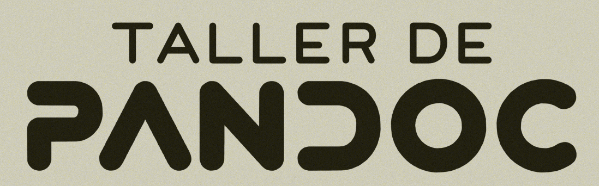

# ¿Qué es pandoc? 

## Multiconversor de archivos

- Una auténtica navaja suiza.
- código abierto.
- creado por el profesor de filosofía [John MacFarlane](https://www.johnmacfarlane.net/)
- Permite pasar de markdown a todo tipo de salida.
- extendible con plugins.

## Una imagen mejor que mil palabras.

- Este documento está exportado a HTML, PDF (Latex) y transparencias (Beamer).

<https://github.com/dmolina/taller_pandoc>

## Generar esta presentación

```sh
make all # o make html para la presentación web
```

Puede regenerarse al editar el md

```sh
ls pandoc.md | entr make pandoc.html
```

# Instalación

## Para este

{width="70%"}

## es necesario

- pandoc versión 2.14 (es la mía, puede funcionar en otras).

- latex, para crear los PDFs.

- make (para usar makefile).

- python3, para poder instalar las extensiones:
   - pandoc-include: Incluya otro.
   - pandoc-citeproc: Referencias.

# Sobre Markdown

## Características

- Es mucho más fácil escribir markdown que html ó Latex.
- Es texto plano con convenciones (negrita, enlaces, ...).

. . .

- pandoc añade algunas opciones.
- pandoc lo transforma a HTML, latex (y PDF).

. . .

- Muchas herramientas de documentación lo usan. 

. . .

<!-- -->

* Generadores de páginas webs (jekyll, hugo, ...).

# Formato de Markdown

## Tipo de fuente

```markdown
Es sencillo poner **negritas**, *cursiva* y ~~tachar~~.
```

Es sencillo poner **negritas**, *cursiva* y ~~tachar~~.

## Enlaces

```markdown
- Enlace directo: duckduckgo es <http://www.duck.com>
- Indicando texto y enlace: 
                        [duckduckgo](http://www.duck.com)
```

- Enlace directo: duckduckgo es <http://www.duck.com>
- Indicando texto y enlace: [duckduckgo](http://www.duck.com)

## Secciones

```markdown
# Titulo
## Sección (Nueva Transparencia)
### Apartado (bloque) 

Texto
```
## Sección (Nueva Transparencia)
### Apartado (bloque) 

Texto

## Imágenes

```markdown

```


## Imágenes con caption

```markdown

```


## Fórmula

```raw
Se pueden poner $x^2$ y $F_1$ directamente.

También se pueden poner ecuaciones como:

$$
A = \frac{\pi r^2}{2}
$$
```

Se pueden poner $x^2$ y $F_1$ directamente.

También se pueden poner ecuaciones como:

$$
A = \frac{\pi r^2}{2}
$$

## Pie de páginas

```raw
Se puede poner un pie de páginas. 
Todo enseñado en el taller[^1]

[^1]: https://osl.ugr.es/2021/11/03/taller-de-pandoc/
```

Se puede poner un pie de páginas.
Todo enseñado en el taller[^1]

[^1]: https://osl.ugr.es/2021/11/03/taller-de-pandoc/

## Incluir tabla

```raw
  Right     Left     Center     Default
-------     ------ ----------   -------
     12     12        12            12
 1234     1234       1234          1234

Tabla:  Demostración de una tabla sencilla
```

  Right     Left     Center     Default
-------     ------ ----------   -------
     12     12        12            12
   1234     1234     1234          1234

Tabla:  Demostración de una tabla sencilla

## Incluir código fuente y tablas

```raw
```python
print("Buenas tardes a todos")
\```
```

```python
print("Buenas tardes a todos")
```

Hay entornos y extensiones para ejecutar el código: **Rmarkdown**, **pandoc-run-python**.

## Hay más cosas

Markdown de Pandoc admite otros elementos, descritos en [^2].

[2] https://garrettgman.github.io/rmarkdown/authoring_pandoc_markdown.html

# Es muy sencillo

## Sintaxis de pandoc

```sh
# Exporta en html (el -s es para crear la web completa)
pandoc -s pandoc.md -o pandoc.html
# exporta en LibreOffice (va mejor que en Word)
pandoc pandoc.md -o pandoc.odt
# exporta en pdf usando latex (documento) 
pandoc pandoc.md -t latex -o pandoc.pdf
# exporta en transparencias en pdf usando beamer
pandoc pandoc.md -t beamer -o pandoc.pdf
# exporta en transparencias con algunas opciones
pandoc pandoc.md -t beamer -Vtheme= -o pandoc.pdf
```

. . . 

Hay muchas opciones, se puede complicar, lo vemos en detalle con el taller.

# A continuación

## Extensiones de Pandoc.

- Referencias. 

- Tablas.

- Citar figuras.

- Incluir documento en otro.

## Transparencias

- Pausas.

- Ajustar tamaño de figuras.

- Alinear texto y figuras (columnas).

- Resaltar código.

## Documentos 

- Referencias. 

- Citar figuras.

## Modo taller

1. Crearemos unas transparencias en PDF.

2. Crearemos un documento con referencias, tablas y figuras.

3. Veremos otros ejemplos.


